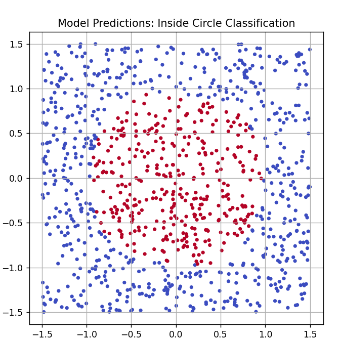

# 🔵 Circle Neural Network Classifier (PyTorch)

This is a personal deep learning project where I trained a simple neural network to classify whether a point lies inside or outside a unit circle centered at the origin. The model is trained using PyTorch and visualized with matplotlib.

---

## 🧠 What it does

- Generates 2D points uniformly in a square
- Labels them based on whether `x² + y² < 1` (inside a circle)
- Trains a 2-layer neural network to learn the decision boundary
- Visualizes model predictions and training loss

---

## 📸 Prediction Example



---

## ▶️ How to run

### 1. Install dependencies:

```bash
pip install -r requirements.txt
```

### 2. Train the model:

```bash
python train.py
```

Model weights will be saved in `saved_model/circle_model.pth`.

### 3. Test the model:

```bash
python test.py
```

You will see prediction accuracy and a plot of predicted point classifications.

---

## 📂 Project Structure

- `model.py`: Neural network architecture
- `train.py`: Model training script
- `test.py`: Evaluation + scatter plot of predictions
- `saved_model/`: Folder storing the trained weights
- `images/`: Visuals for README

---

## 📌 Technologies Used

- PyTorch
- Matplotlib
- Python 3.10+

The trained model (`.pth` file) is included and was trained entirely from scratch on synthetic data.
